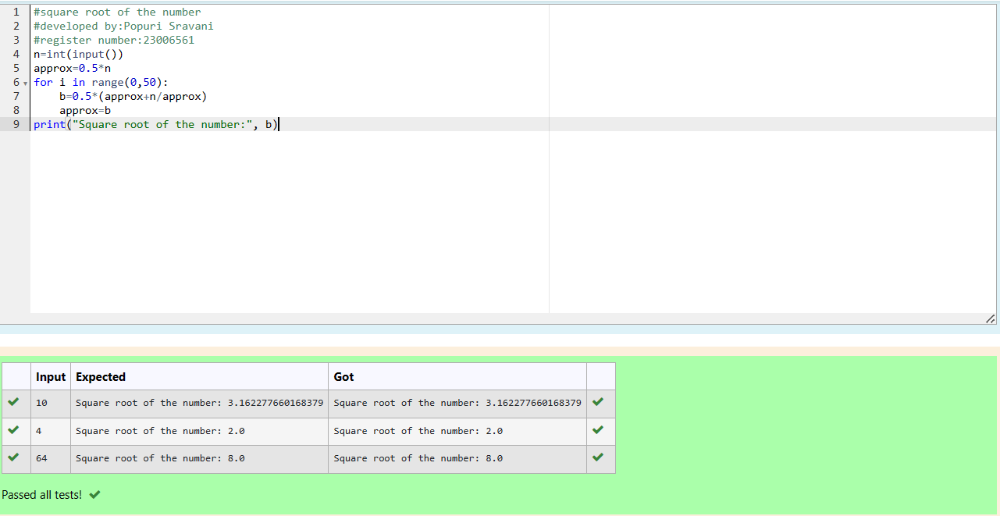

# Find the square root of a number

## AIM:
To write a program to find the square root of a number.

## Equipments Required:
1. Hardware – PCs
2. Anaconda – Python 3.7 Installation / Moodle-Code Runner

## Algorithm
1. Define a function.
2. Assign number_iters = 50 in the function to perform 50 iteratios.
3. Set i = 0.
4. Calculate  number = 0.5 * (number + a / number) for 50 iterations.
5. Print the square root of the number.

## Program:
```
#square root of the number
#developed by:Popuri Sravani
#register number:23006561
n=int(input())
approx=0.5*n
for i in range(0,50):
    b=0.5*(approx+n/approx)
    approx=b
print("Square root of the number:", b)
```

## Output:



## Result:
Thus the program to find the square root for the given number(newton's method) using function is written and verified using python programming.
